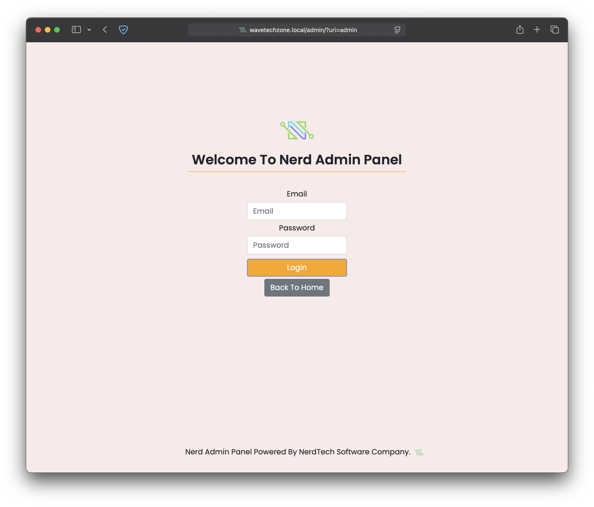
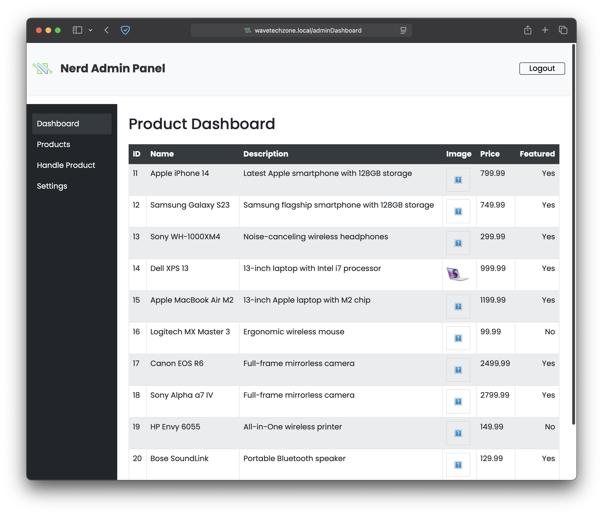

# Wave Techzone - Computer Shop Website


Wave TechZone is a real client project and fully responsive Computer Shop website,
Responsive for all devices, build using HTML, CSS,Bootstrap5 and JavaScript.

[**➥ Live Demo**](http://wavetechzone.free.nf/)

## Prerequisites

Before you begin, ensure you have met the following requirements:

- [Git](https://git-scm.com/downloads) must be installed on your operating system.

## Run Locally

To run **WaveTechZone** locally, run this command in your terminal:

```bash
git clone git@github.com:ChandupaJay1/WaveTechzone.git
```

## Demo Screeshots





## Contact

If you want to contact with me you can reach me at [Twitter](https://www.twitter.com/#).

## License

This project is **Not free to use** and does not contains any license.
